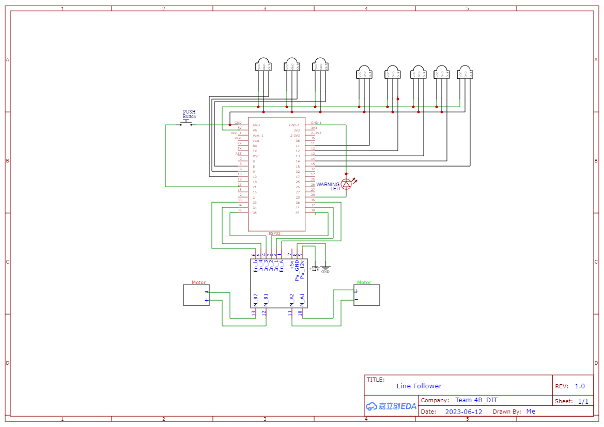

# Line following robot with obstacle sensing using only IR sensors

This project is a novel implementation of a simple low cost line following robot with only IR sensors, capable of following the path and avoid obstacles.

## Demo

[Demo](assets/demo.gif)

A full video demonstration is available [demo](demo/Topic4_GroupB_LineFollowRobot_demo_video_1.mp4).

## Project Description

The project is a simple line following robot with obstacle sensing capabilities. The robot is designed to follow a black line on a white surface and avoid obstacles in its path. The robot is equipped with three IR sensors for line following and two IR sensors for obstacle detection. The robot is programmed to follow the line using the line following sensors and avoid obstacles using the obstacle detection sensors. The robot is controlled by an ESP32 board and powered by a battery. The robot is designed to be simple, low-cost, and easy to build, making it suitable for educational purposes and hobby projects.

Please refer to the [report](./report/LineFollowRobot_CS_Embedded_project_report.pdf).

## Prerequisites
### Software
1. Arduino IDE
2. Proteus 8.10
3. Visual Studio Code (optional)

## Usage
Will be updated soon.

## Schematic

- The bill of materials is available in the [BOM](BOM/LineFollowingRobot_BOM.xlsx).
- You can find a few test paths in the [test paths](test_paths) folder.

## Contribution
Contributions to this project are welcome. Please fork the repository and submit a pull request with your improvements.

## Additional information
The project can be further refined by modifying the code and further including test cases, which are scheduled to be done by the time of the final presentation.

If you like this project, please give a star and share the project with others.

## Contact
For any questions or inquiries, please contact [me](https://github.com/Bharadhwajsaimatha).

## License
No license is required for this project.

